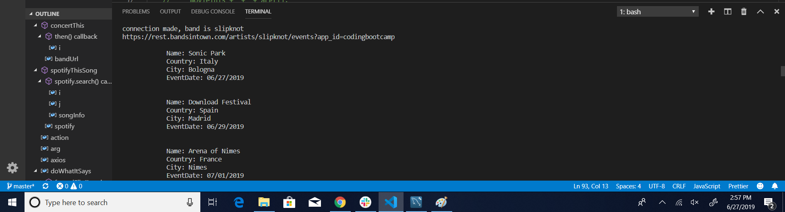
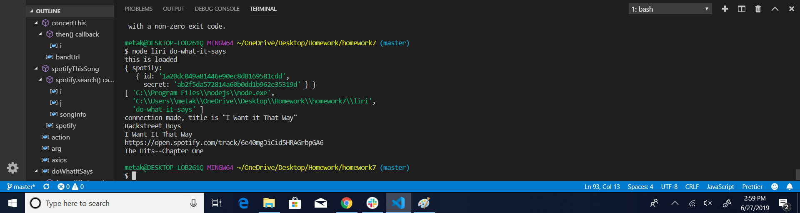
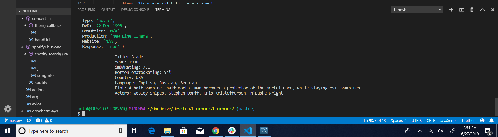
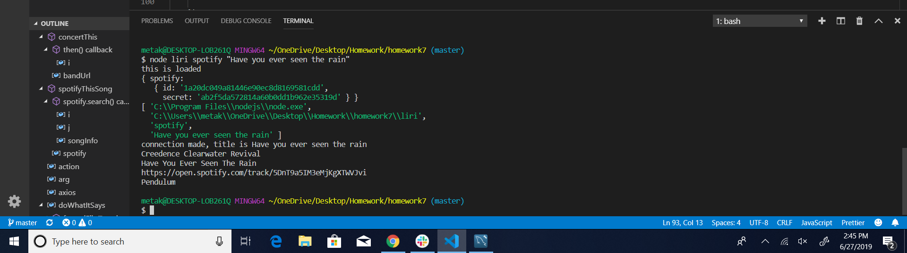

# homework7

Use the liri.js to search for bands in town, movies, and spotify songs. Type in node liri.js plus the terms used in the switch function to search within the three choices. When you type in the name of a band, a song, or the name of the movie that is more than one word, use quotes around them.

Run liri concert and the name of the band to get the list of their upcoming tours.

Run this command to get the expected results in the image.

Run the command to get the expected results in the image.

Run the command to get the spotify results in the image.